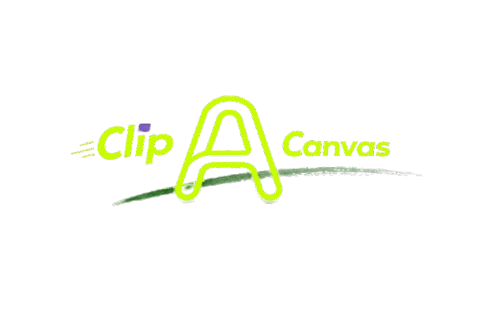

# Clip.A.Canvas

<p align="center">
  
</p>

**Clip.A.Canvas** is a desktop HTML-to-video renderer for creators who want to turn front-end motion into MP4 files locally.

Paste HTML, CSS, and JavaScript into the app, preview it in a real browser engine, and export the result as video using Chromium plus FFmpeg. No hosted backend. No upload step. No screenshot-based fake rendering path.

- Website: `https://clipacanvas.vercel.app`
- Releases: `https://github.com/mechreaper007x/code2video-renderer/releases/tag/v1.0.0`
- Product name: `Clip.A.Canvas`
- Current repository slug: `code2video-renderer`

## What It Does

- Renders HTML/CSS/JS, SVG, and canvas-based animations into MP4.
- Uses Playwright + Chromium for browser-accurate rendering.
- Encodes locally with FFmpeg.
- Runs as a desktop app through `pywebview`.
- Lets the user save the finished MP4 through a native file dialog.

## Why This Exists

Most “HTML to video” workflows either rely on cloud rendering, break on real browser animation behavior, or force a manual screen-recording step. Clip.A.Canvas keeps the workflow local and deterministic:

- Browser rendering is handled by Chromium.
- Video encoding is handled by FFmpeg.
- The desktop UI wraps the whole flow into a single local app.

## Stack

- Frontend: HTML, CSS, Vanilla JavaScript
- Desktop shell: `pywebview`
- Local server: Python
- Renderer: Playwright / Chromium
- Encoder: FFmpeg (`libx264`)
- Packaging: PyInstaller, Inno Setup

## Quick Start

### Install Dependencies

```bash
git clone https://github.com/mechreaper007x/code2video-renderer.git
cd code2video-renderer
pip install -r requirements.txt
pip install -r desktop_requirements.txt
npm install
python -m playwright install chromium
```

If you prefer the Node script path for browser setup, this also works:

```bash
npm run install:browsers
```

### Run the App

On Windows:

```bash
launch_desktop.bat
```

Or directly:

```bash
python desktop_app.py
```

On macOS:

```bash
chmod +x launch_desktop.command
./launch_desktop.command
```

## Build Outputs

### Windows Portable EXE + ZIP

```bash
python build_desktop.py
```

Outputs:

- `dist/ClipACanvas.exe`
- `dist/ClipACanvas-windows.zip`

### Windows Installer

```bash
python build_installer.py
```

Output:

- `dist/ClipACanvas-Setup.exe`

### macOS App Bundle

Run this on macOS:

```bash
python3 build_mac_app.py
```

Outputs:

- `dist/ClipACanvas.app`
- `dist/ClipACanvas-macos.zip`

### macOS Helper Build Script

```bash
chmod +x build_mac_safe.command
./build_mac_safe.command
```

## Release Workflow

Build the distributables first, then generate release metadata:

```bash
python build_release_assets.py --version v1.0.0
```

This generates:

- `dist/SHA256SUMS.txt`
- `dist/RELEASE_NOTES.md`

Ship releases through GitHub Releases. Windows builds are currently unsigned, so SmartScreen or Defender reputation warnings can still appear on first run.

## Project Layout

- `clipacanvas.html`: main app UI
- `desktop_app.py`: desktop launcher
- `serve.py`: local backend and render endpoint
- `playwright_render.py`: Python renderer path
- `playwright_render.mjs`: Node renderer fallback
- `build_desktop.py`: packaged desktop build
- `build_installer.py`: Windows installer build
- `build_mac_app.py`: macOS app build
- `website/`: marketing/download site
- `tests/frontend_render_matrix.py`: frontend render regression suite

## Notes

- The portable Windows build is a single-file executable that unpacks the bundled Chromium and FFmpeg payload at runtime.
- The installer is the simplest Windows distribution path for non-technical users.
- macOS packaging must be built on macOS.
- The repo name can differ from the product name; the app branding is `Clip.A.Canvas`.

## License

MIT.
